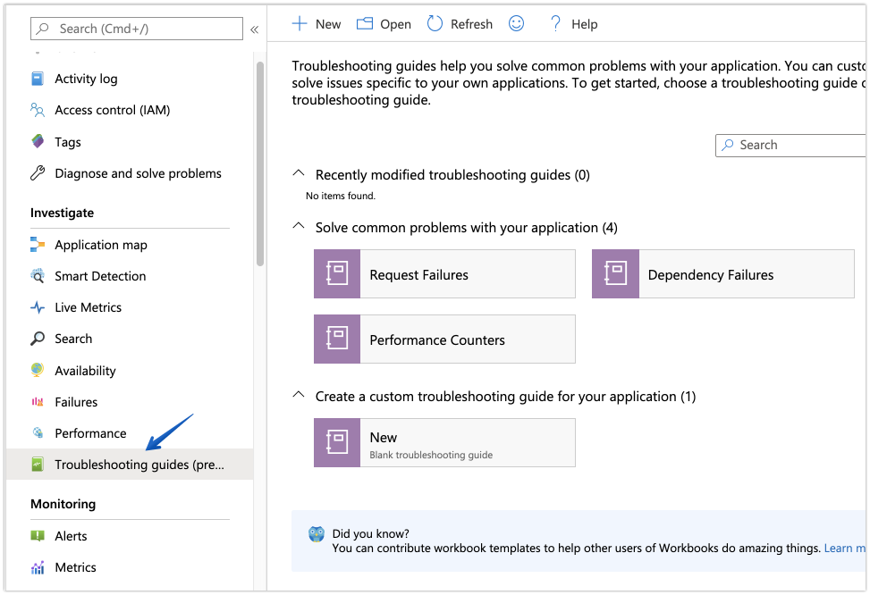
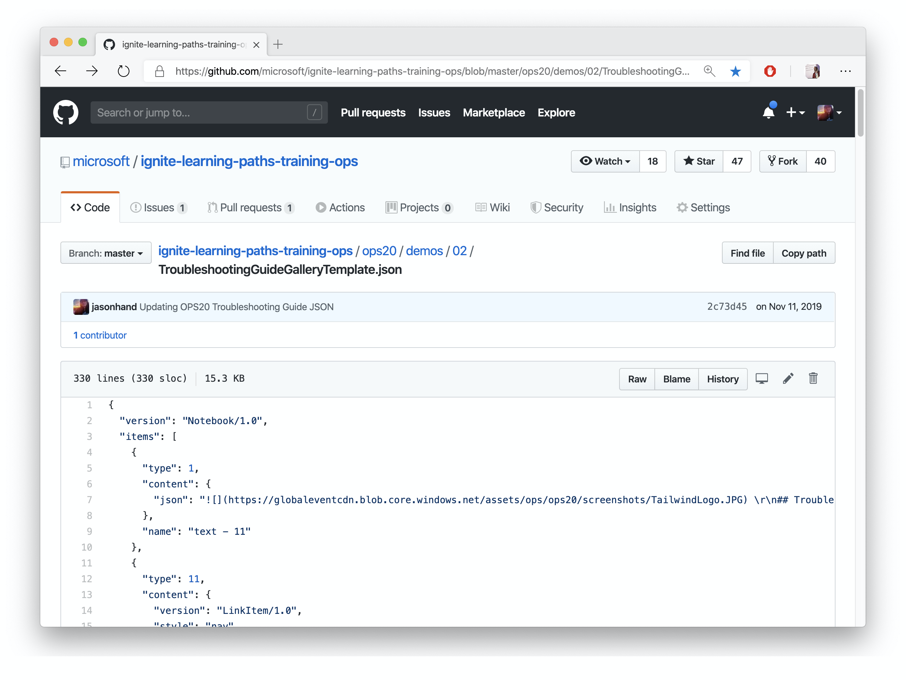

Also referred to as [Workbooks in Azure Monitor](https://docs.microsoft.com/en-us/azure/azure-monitor/app/usage-workbooks/?WT.mc_id=oncalllife-blog-jahand), interactive reports can be quickly built to provide critical information to first responders as they begin to investigate and take early remediation efforts.

Guides can include data from sources such as logs, metrics, and more through visualizations like charts, grids, graphs, and text.

Everything displayed in the troubleshooting guide can be customized on the fly through parameters making it interactive.

The name *Troubleshooting Guide* is specific to the workbooks made available through Azure's Application Insights. To view a gallery of templates or to create a new guide, select **Troubleshooting Guide** from the Investigate section of the left navigation pane.

Troubleshooting guides are ultimately just JSON files, which means they can be handled just like code. You can put them in a repository right next to your code, infrastructure, deployment pipelines, and more.

To view an example of a Troubleshooting Guide represented in JSON, [take a look at this sample](https://github.com/microsoft/ignite-learning-paths-training-ops/blob/master/ops20/demos/02/TroubleshootingGuideGalleryTemplate.json).

Troubleshooting Guides can often provide the jumpstart first responders need to begin diagnosing. By freeing up their cognitive tasks for something other than remembering where resources are, engineers can make a positive difference faster.

Supplying context and guidance rather than rigid step-by-step processes allows engineers to be creative in novel situations. If an engineer can follow each step of a check list to recover from the problem then it is time to automate that "known" fix and free up incident response for scenarios that couldn't have been predicted or fixed through a linear process.

Keeping people informed is a big driving force behind efforts during incident response. Troubleshooting guides are no exception. When engineers (also stakeholders in the incident) are informed with objective data, they can take appropriate action based on information they have available to them.  

[Updating Stakeholders](/post/updating-stakeholders/) can be done in many ways. Let's take a look at a few examples.