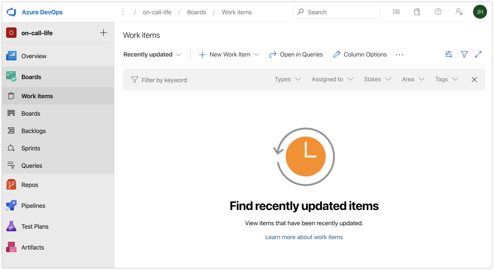
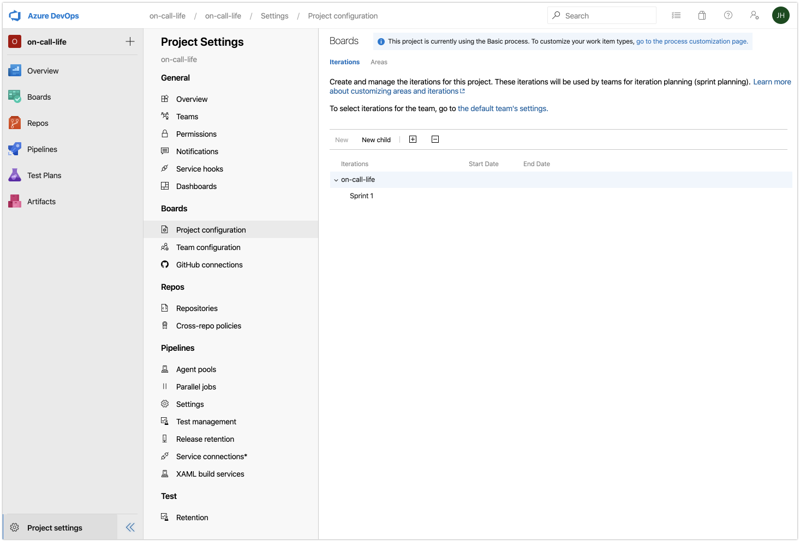
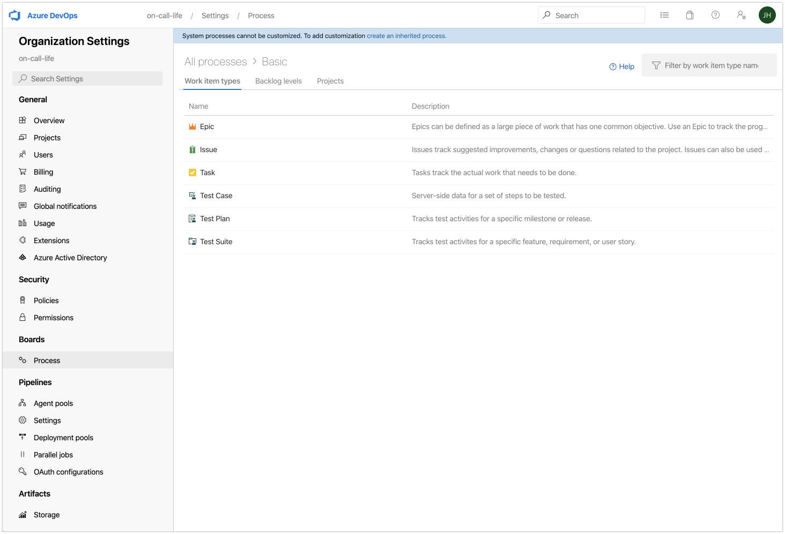
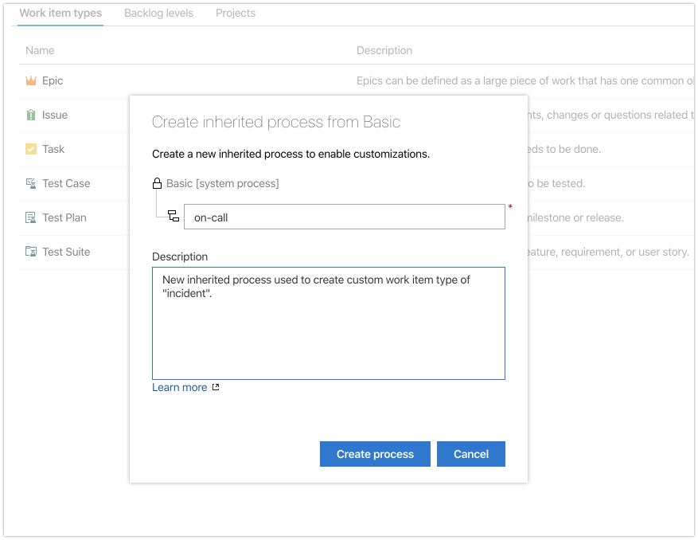
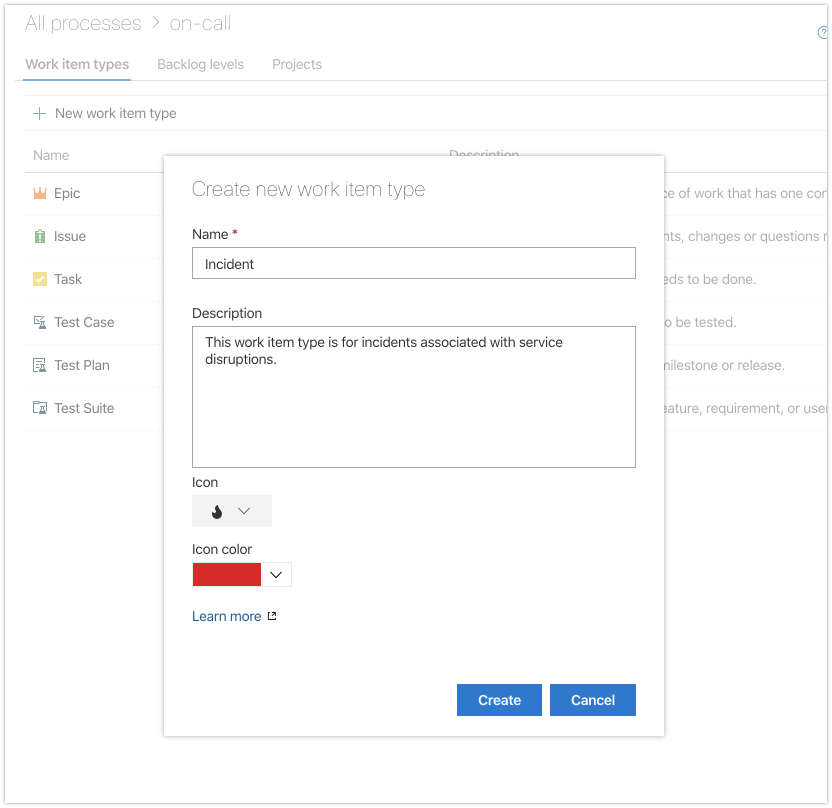
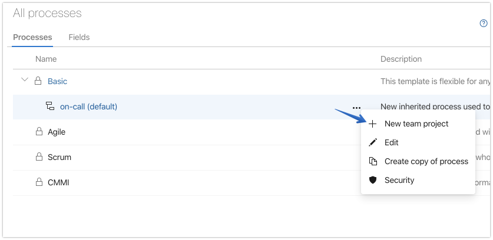
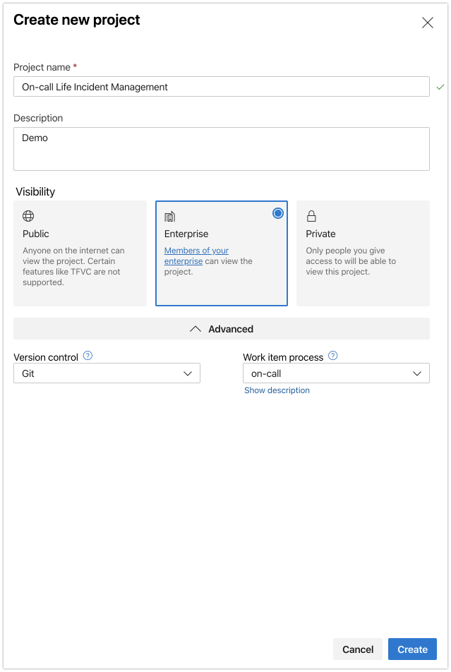
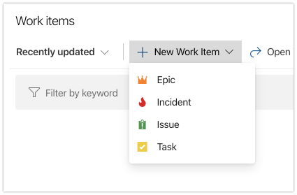
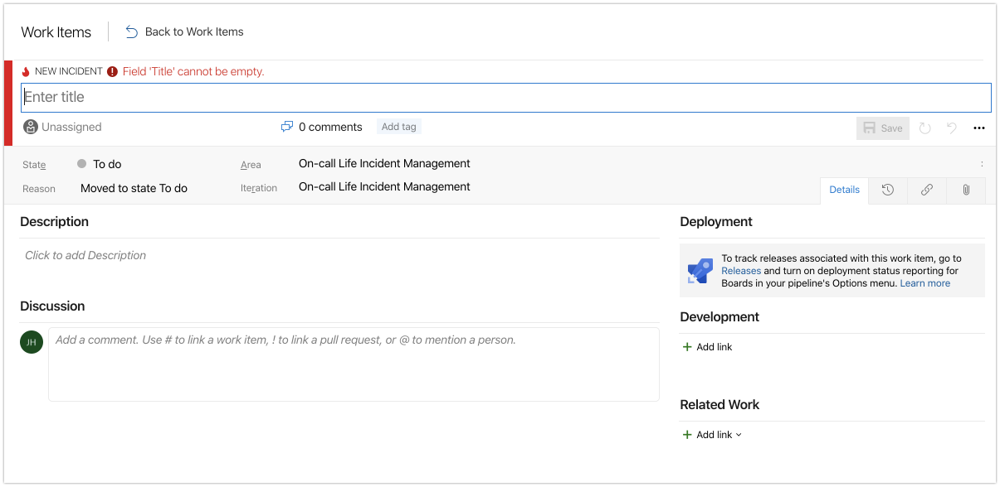

Tracking incidents is as easy as setting up a datastore, like the table storage used for the on-call roster. However, why reinvent the wheel? Why not use something already available, customizable, extensible, and free?

Azure Boards is my tool of choice in this tutorial, but honestly this could probably be done with any popular project management tool with an API.

{}
First, login or create a [free Azure **Devops** account](https://azure.microsoft.com/?wt.mc_id=oncalllife-blog-jahand).
{}

**1.** Select an existing or create a new project in **Azure Devops**
   
**2.** Click on **Work Items**

In the left navigation menu, choose **Work Items** under the Boards group. This is what we will use to track our incidents.

But before we do, we need to create a custom work item type and then start a new project based on different default options.

**3.** Navigate to the **Project Configuration** settings

The **Project Settings** icon is in the lower left. Then select **Project Configuration**.

From here we will create a custom work item type for incidents.

**4.** Click the "**go to the process customization page**" link in the upper right

This is where we can view existing **Work Item Types** as well as create new ones. But first, we have to create a new inherited process in order to enable customizations.

**5.** Click on the "**create an inherited process**" link near the top

Give it a name, such as `on-call` and a description.

Once you click "**Create process**" you'll be returned to the previous screen where you can now select the **+ New work item type** option.

Give it a name, like `Incident`, a description, icon, and icon color. Then press create.

From the next screen click on **Process** found in the **Boards** section of the left navigation pane. You'll see the new inherited process "on-call".

**6.** Click the settings elipses **(...)** followed by **+ New team project**.

**7.** Click create **new project**

Give the project a name, description, and a few other selections and press **create**.

We will use this new project for all incident tracking leaving the original project for something else.

Let's check to see if our new work item type is available. Return to Azure Boards.

**8.** Click the **+ New Work Item** option

You'll now see an additional work item type of "**incident**".

Select the Incident option to view the default fields available to track details.

We can see that we have a number of fields available to us by default such as **Assigned To**, **State**, **Discussion**, and more.

We now have a basic way of tracking incidents. Any time an incident is detected, we can add a new work item type of "incident" along with the important details so that there is a central place for everyone to stay informed.

However, the default settings only provide us a few important things that we want to track. We mentioned before that we'd like to track when, how, who, and what we know about the incident.

We can easily add and modify fields within Azure Boards to allow for tracking additional details we know are important to our incident response efforts.

Now, let's talk about ways of [Customizing Azure Boards for Incident Tracking](/post/customizing-azure-boards-for-incident-tracking/)

