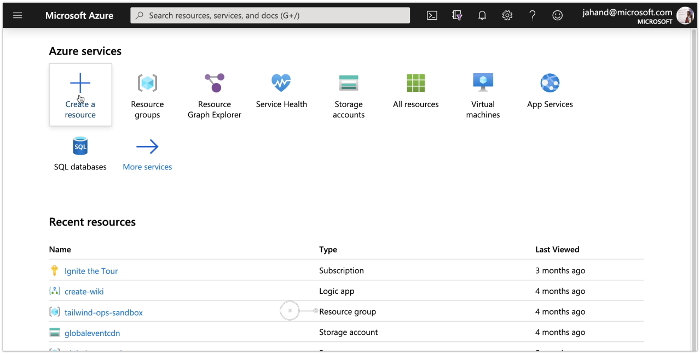
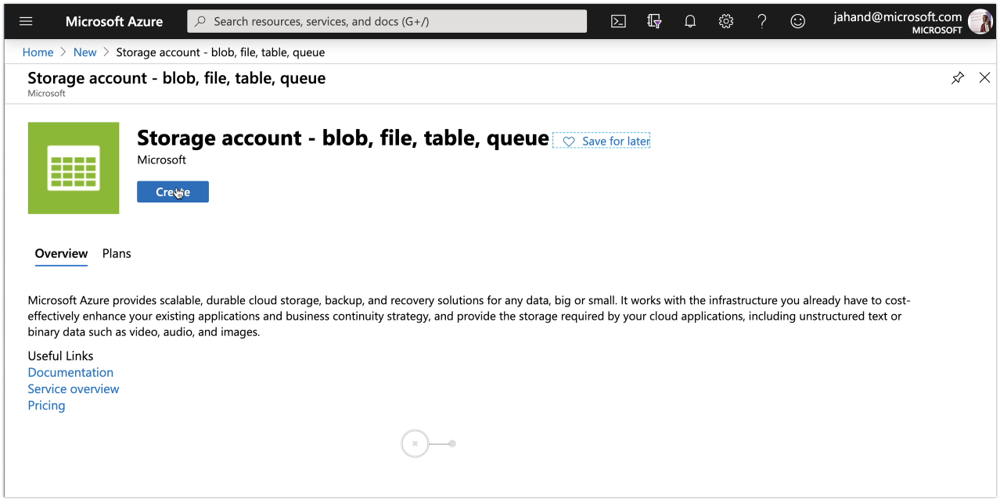
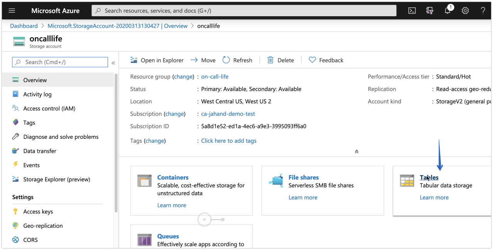
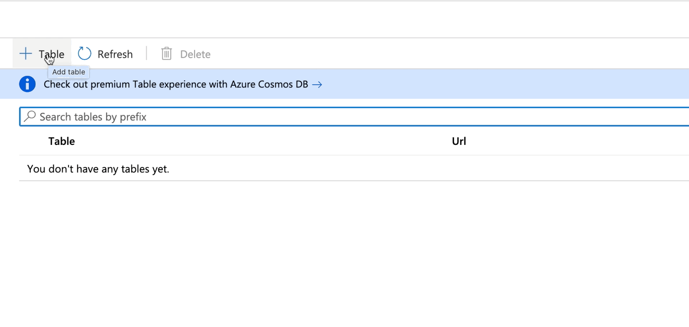
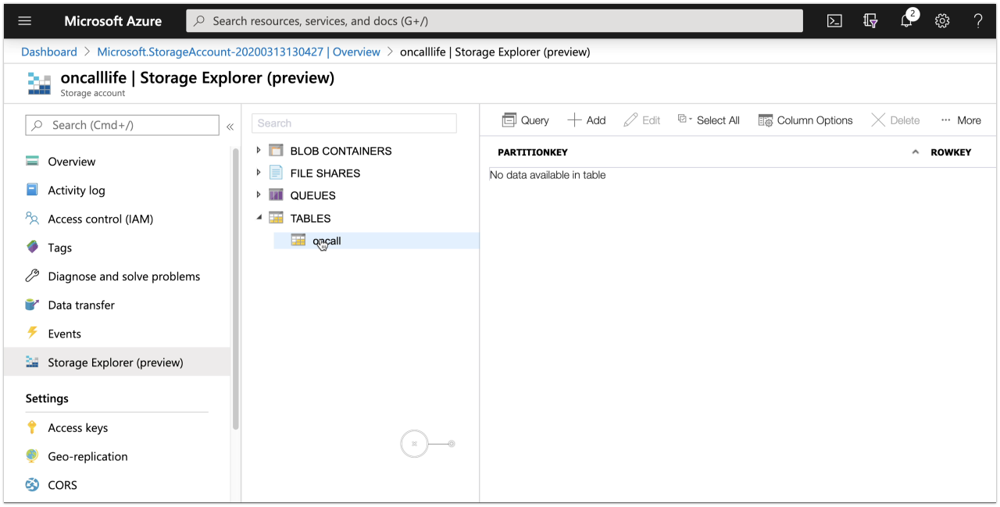
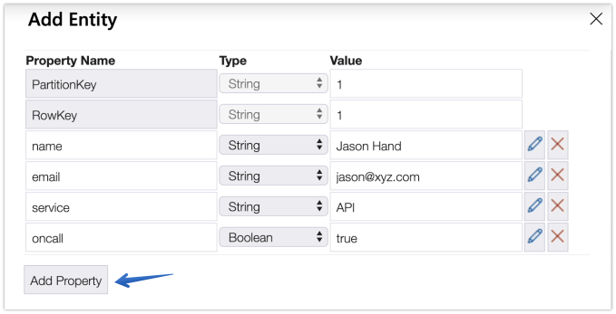
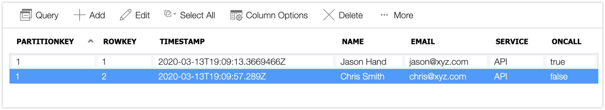

On-call rosters allow teams to identify who is responsible for acknowledging and addressing incidents as they occur.

They are made up of the names and contact information of everyone expected to take part in the response and remediation of service disruptions.

**On-call Roster**

|Name   |Email   |Service   |On-call   |
|---|---|---|---|
|Jason Hand   |jason@xyz.com   |API   |Yes   |
|Chris Smith   |chris@xyz.com   |API   |No   |
|Lauren Jones   |lauren@xyz.com   |Mobile   |Yes   |
|Ryan Boggs   |ryan@xyz.com   |Database   |Yes   |

Depending on the make up of your teams and services, on-call rosters can remain quite simple or become extremely complex.

One way of creating an on-call roster is with a basic storage table in Azure.

## Setup

{}
First, login or create a [free Azure account](https://azure.microsoft.com/?wt.mc_id=oncalllife-blog-jahand).
{}

**1.** Create a new resource
From the home screen in Azure, select the option to **create a resource**.

**2.** Search for and select "**Storage Account**"

**3.** Select a **subscription**, **resource group**, etc.

Choose where you want the storage account created, what name you want to give it, as well as the type of disk and access tiers and then choose **Review & Create**, followed by **Create**.

**4.** Go to the (**Storage Account**) resource

**5.** Click on the **Tables** card

**6.** Click the **+ Table** option and give it a name of `oncall`

**7.** Click on **Storage Exploror**

**8.** Click on **Tables**, then **oncall**, then **+ Add**

**9.** Add **entity**

The **PartitionKey** field will remain the same. Add new properties for **name**, **email**, **service**, and **oncall**. All properties should be set to a *string* type, except for **oncall**. It is a boolean. Once all fields have been added, press **Insert**.

**10.** Repeat the process for new entities. 
Make sure to use the same PartitionKey but a unique rowkey. Also be sure to use true or false for the oncall field.

After a couple of entries, it should look as follows.

That's it. You've taken your first steps towards building a basic on-call roster. This will help us identify who to initially alert when an incident occurs.

{}
This example roster tracks only the "**Primary Responder**" (i.e. `oncall=true or false`). It doesn't include any alternative contact information. Nor does it identify what rotations someone is associated with.
  
Try expanding your roster to contain more of the roles previously discussed.
{}

Next, we will take a look at [Establishing On-call Rotations](/post/establishing-oncall-rotations/)