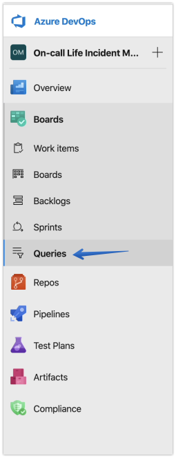
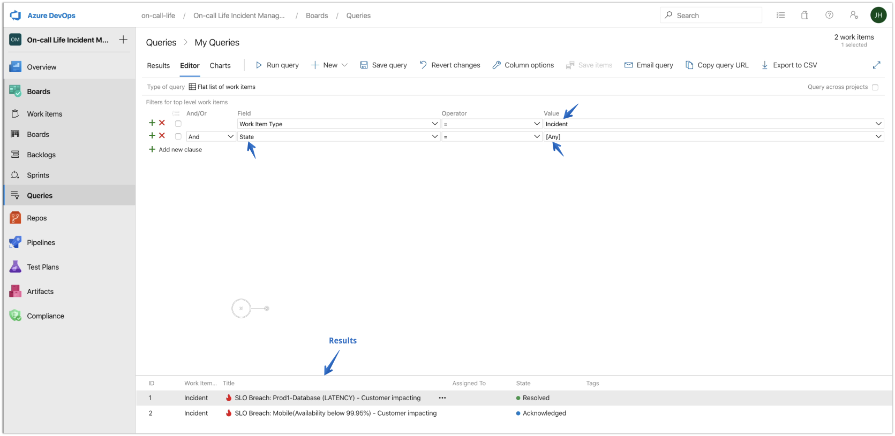
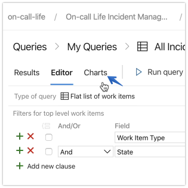
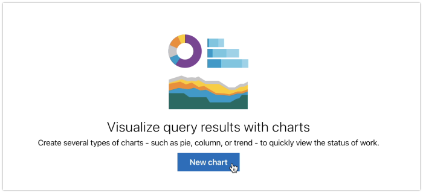
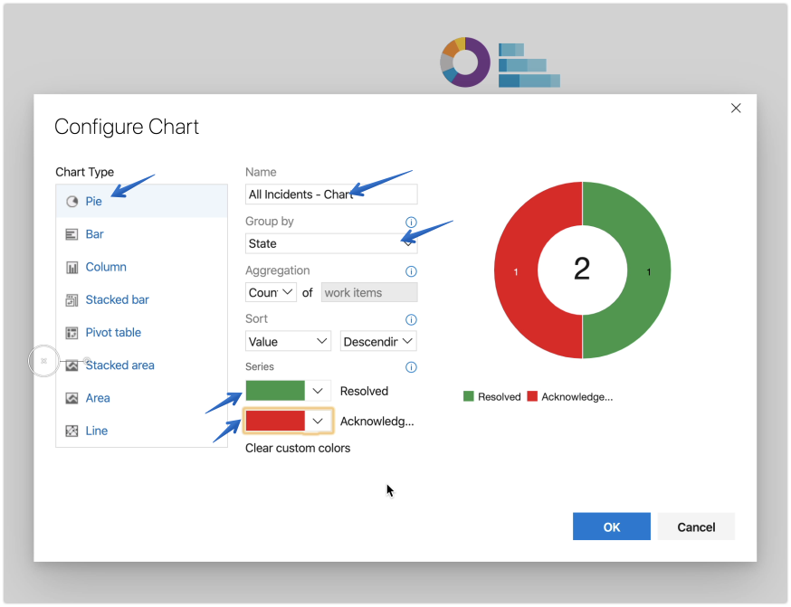
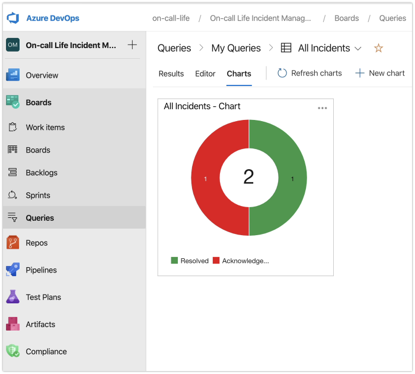

For the most part, incidents are unique.

Therefore the lessons learned will vary from problem to problem. However, it's helpful to spot trends in response efforts to both identify what is working and what needs improvement.

It's also helpful for engineering teams to have a sense of how frequent problems are arising and how quickly they are addressed and resolved.

When tracking incidents using Azure Boards, it's quite simple to build reports and charts provide a high level snapshot of incident management efforts.

## Create a Query

**1.** Select the **Queries** option in the left navigation

**2.** Customize the query

Select the  clauses, fields, and values of interest to easily build queries and report back information such as *"Show me **ANY** incident"* in this example.

You'll see the results at the bottom of the screen. In our case we only have two incidents. One is **resolved** and one is **acknowledged**.

**3.** Save the query

Press the **Save query** menu option and give it a name such as **"All Incidents"**.

##  Create a Graph

To create visualizations of the queries, begin by changing to the **Charts** option.

**1.** Click on **Charts**

**2.** Click on **New Charts**

**3.** Configure the chart

Choose the type of chart you want to use (Pie in this example). Give the chart a name, such as "All Incidents - Chart". Choose how you want the data grouped, like "State" (**New Incident, Resolved, Acknowledged, etc.**)

Choose a color to represent the data and press Ok.

Now you have a high level visual to communicate the state of incidents.

Now that we've discussed ways to help track the response of an incident, let's take a moment to discuss ways of [Improving the Remediation of Incidents](/post/improving-the-remediation-of-incidents/).