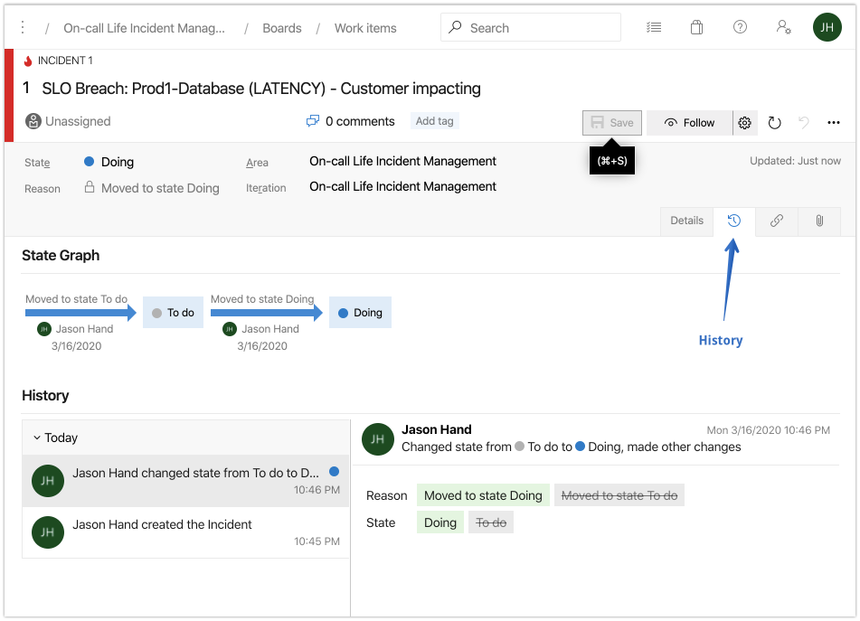
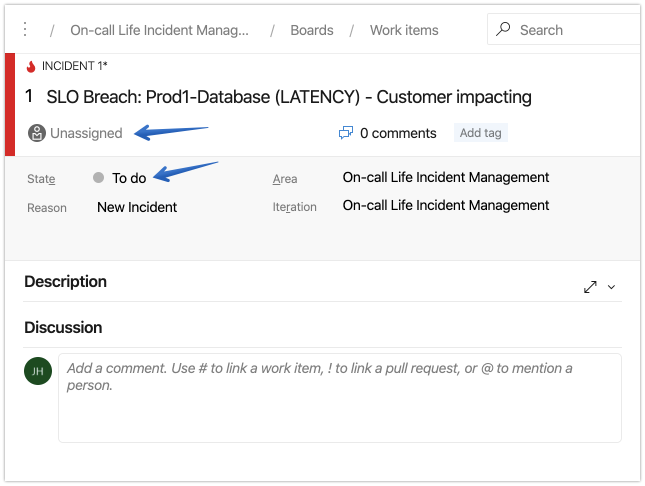
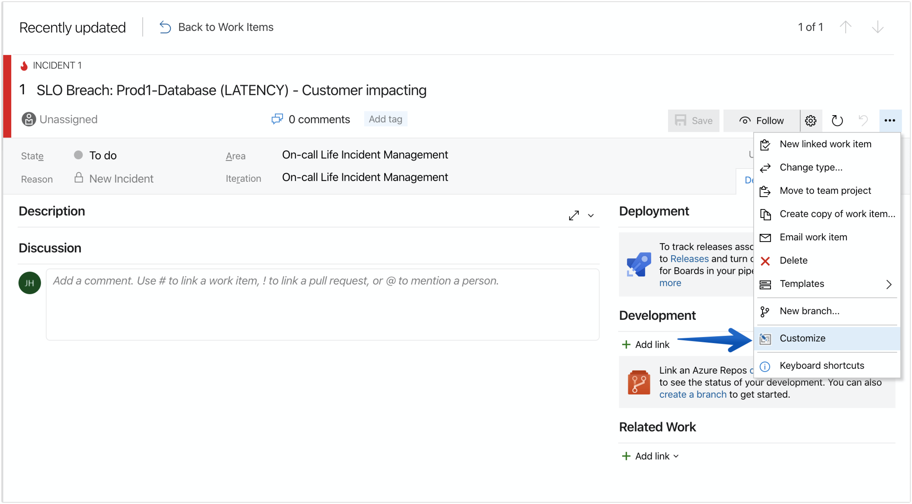
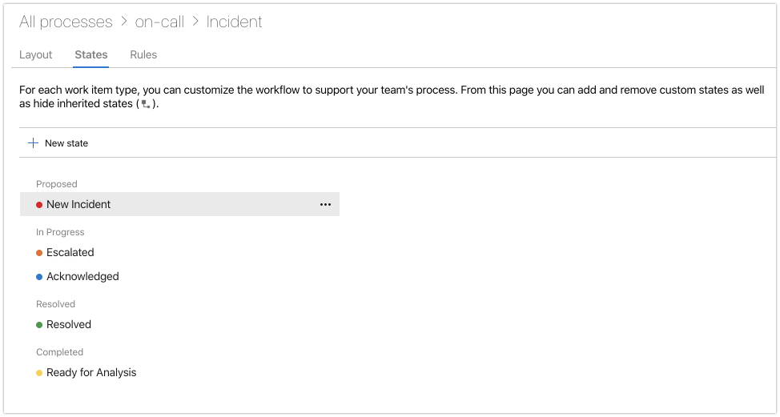
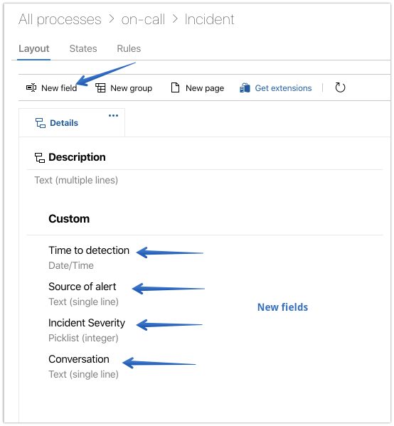
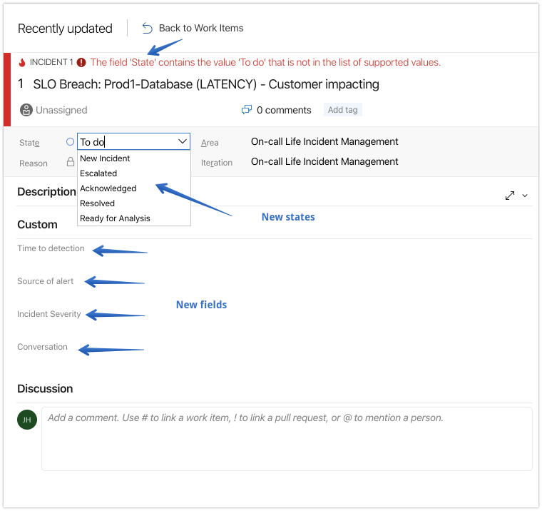

Now that we have [a tool to track the incident details](/post/creating-an-incident-tracking-tool-with-azure-boards/), we need to ensure we are tracking all of the important aspects. Such as *When did we know about the problem* and more.

Let's now take a look at how we can customize Azure Boards to track additional incident details.

## When did we know?

When a new record (or incident) is created in Azure Boards we will automatically have the date and time as well as a change log throughout the incident's lifecycle...

However, it would be good to have a separate field where we can also capture when our systems were detecting the issue. It is possible that while no alerts were triggered for humans to respond, the data was there if only we were monitoring and alerting on it.

## How did we know?

The default fields do not provide anything suitable to capture this information. We will need to create a new field to start tracking it.

## Who is aware?

Using the **Assigned To** field we can attempt to communicate some awareness. If the first responder updates the State (to **Acknowledged**), and sets the **Assigned To** field to themself, it acknowledges to others that someone has been alerted and is investigating.

## What is the impact?

When possible, it's best to include context such as "customer impacting" in the alert itself. This allows immediate contextual awareness and a sense of urgency. We can create a new field to track the official severity level.

## What is being done?

Naturally, anyone looking at the details of the incident are going to want to know what is being done. The **description** and **discussion** fields provide great places for responders or others assisting in the efforts to update the larger audience on what is being done and what expectations to have regarding future updates.

However, real-time updates on what is taking place can be found within the chat channel where engineers are collaborating during the response.

It would be useful to provide a link or information for others to follow if they would like to observe the conversation as it unfolds. We will need to create a field specifically related to the conversation.

Let's now customize Azure Boards to satisfy our basic needs of tracking an incident.

## Creating New Fields

**1.** Click the "**Customize**" option under the **(...)** in the upper right.

Before we create new fields, let's first make changes to the **"State"** of incidents to better align with industry terminology.

**2.** Click on **+ New State**

Delete the existing ones and create new states that better align with terminology used. Such as **Acknowledged** (ACK), **Escalated**, etc.

**3.** Click on **Layout**

Then add new fields using the button below

**4.** Confirm changes
 
When you return to the incident, you'll notice a warning message pointing out that the current state of "To do" does not match the existing options.

You'll also see the new fields that we have added (Time to detection, source of alert, etc.)

This should be a good place to start capturing information that will be helpful and important to analyze in a post-incident review later.

With the information tracked in Azure Boards along with the conversations taking place in Microsoft Teams we will have a lot of great data to analyze.

From that analysis we will measure and establish baselines and expectations around incident response.

It's important to discuss [measuring incident response](/post/measuring-incident-response/) now. However, on our path to continuous improvement there are certain traps we want to avoid when examining incidents, especially in aggregate.