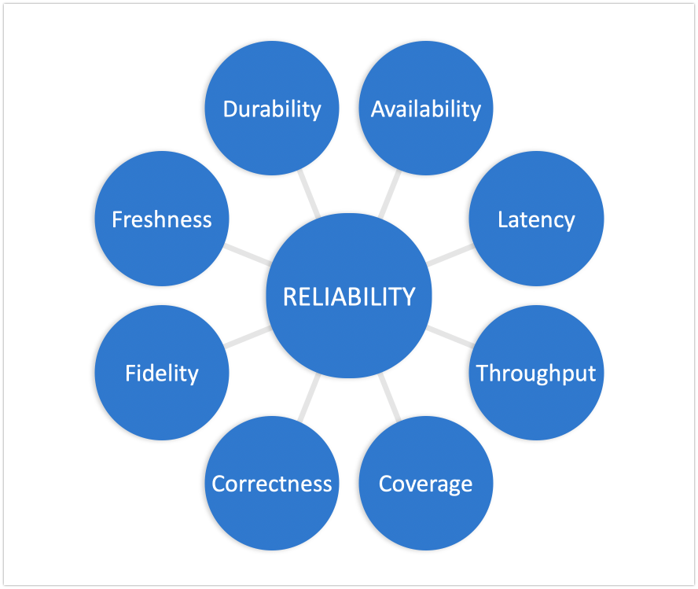

When deciding what to monitor for reliability it becomes clear that there are many approaches because there are many aspects to reliability. It's important to examine the reliability of your service from the user's perspective to determine what is important and how to prioritize.

## What Does Reliability Mean to the User?

To determine the reliability of a system, service, application, or process many look to a combination of the following eight aspects of reliability.

- Availability
- Latency
- Throughput
- Coverage
- Correctness
- Fidelity
- Freshness
- Durability

Once it is determined which aspects to measure and how, we can begin understanding the behavior of our systems under "normal" conditions.

## Establish a Baseline

Establishing a baseline of reliable performance helps set expectations and recognize deviations from what you might call "normal". Once you have a baseline, you can do a comparison.

[Exploring the Availability Aspect of Reliability](/post/exploring-the-availability-aspect-of-reliability/)

>NOTE: Look in to "The Golden Signals" - Jason Hand
