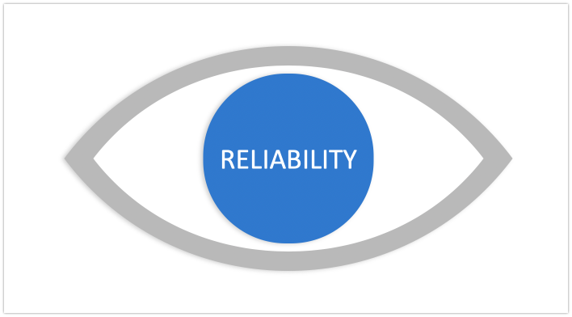

These eight components cover a big part of reliability. Not all of the factors will apply in every situation.

When considering these factors, the most important point to remember is (again) that reliability has to be measured from the customer’s perspective, not the component perspective. Knowing our CPU's running at over 90% utilization has no correlation to what our users are experiencing, let alone doing.

[Understanding Measurements of Reliability](/post/understanding-measurements-of-reliability/)